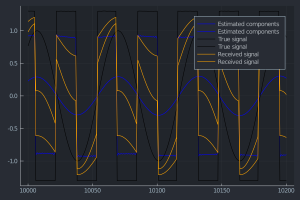
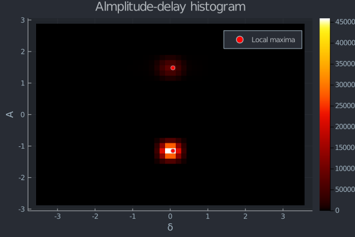

# IndependentComponentAnalysis

[](https://github.com/baggepinnen/IndependentComponentAnalysis.jl/actions)
[](https://codecov.io/gh/baggepinnen/IndependentComponentAnalysis.jl)


## ICA
This package modifies the implementation of the FastICA algorithm from [MultivariateStats.jl](https://github.com/JuliaStats/MultivariateStats.jl) to make it more than 5x faster. This comes at the expense of taking an additional dependency, on [LoopVectorization.jl](https://github.com/chriselrod/LoopVectorization.jl) and some additional compilation time.

This package also modifies the interface to the algorithm slightly, use it like this:

```julia
using IndependentComponentAnalysis
X = randn(4,100)
k = 2 # Number of components to extract
ica = fit(ICA, X, k,  alg = FastICA();
                fun       = Tanh(),
                do_whiten = true,
                maxiter   = 100,
                tol       = 1e-6,
                mean      = nothing,
                winit     = nothing
      )

Xt = transform(ica, X)
```

- The options for `fun` are `Tanh(a::Real)` and `Gaus()`
- If you have also loaded MultivariateStats, a conflict will arise, cauing you to have to qualify `fun` like this: `IndependentComponentAnalysis.Tanh` etc. If [this PR](https://github.com/JuliaStats/MultivariateStats.jl/pull/122) is merged, this package will work better together with MultivariateStats.


## DUET

[DUET](https://www.researchgate.net/publication/227143748_The_DUET_blind_source_separation_algorithm) (Degenerate Unmixing Estimation Technique) is an algorithm for blind source separation. It works on stereo mixtures and can separate any number of sources as long as they do not overlap in the time-frequency domain. The interface looks like this:


```julia
est, H = duet( x1, x2, n_sources, n = 1024;
                    p            = 1, # amplitude power used to weight histogram
                    q            = 0, # delay power used to weight histogram
                    amax         = 0.7,
                    dmax         = 3.6,
                    abins        = 35,
                    dbins        = 50,
                    kernel_size  = 1, # Controls the smoothing of the histogram.
                    bigdelay     = false,
                    kernel_sizeδ = 1,
                    window       = hanning,
                    kwargs..., # These are sent to the stft function
)
```

The returned values are `est::Matrix(time, n_sources)` and `H::DUET`.
`H` can be plotted `plot(H)`, which shows the delay/amplitude histogram and the identified peaks. This can be used to tweak the input parameters.

- `bigdelay` indicates whether or not the two microphones are far apart. If `true`, the delay `δ` is estimated using the differential method (see the paper sec 8.4.1) and the delay map is smoothed using `kernel_sizeδ`.

#### Example:
```julia
t  = 0:0.1:2000
x1 = sin.(t)
x2 = @. 1.3 * sign(sin(2t + 0.2) ) + 0.001 * randn()
W  = [0.3 0.7; 0.6 0.4] # Mixing matrix
R  = W * [x1 x2]'
r1, r2 = R[1, :], R[2, :]

est, H = duet( r1, r2, 2, 1024,
    dmax        = 3.5,
    amax        = 2.8,
    kernel_size = 1,
)

plotinds = 10000:10200
plot(plotinds, est[plotinds,:], lab = "Estimated components", c = :blue)
plot!(plotinds, [x1 x2][plotinds,:], lab = "True signal", c = :black)
plot!(plotinds, [r1 r2][plotinds,:], lab = "Received signal", c = :orange) |> display

plot(H) |> display
```


